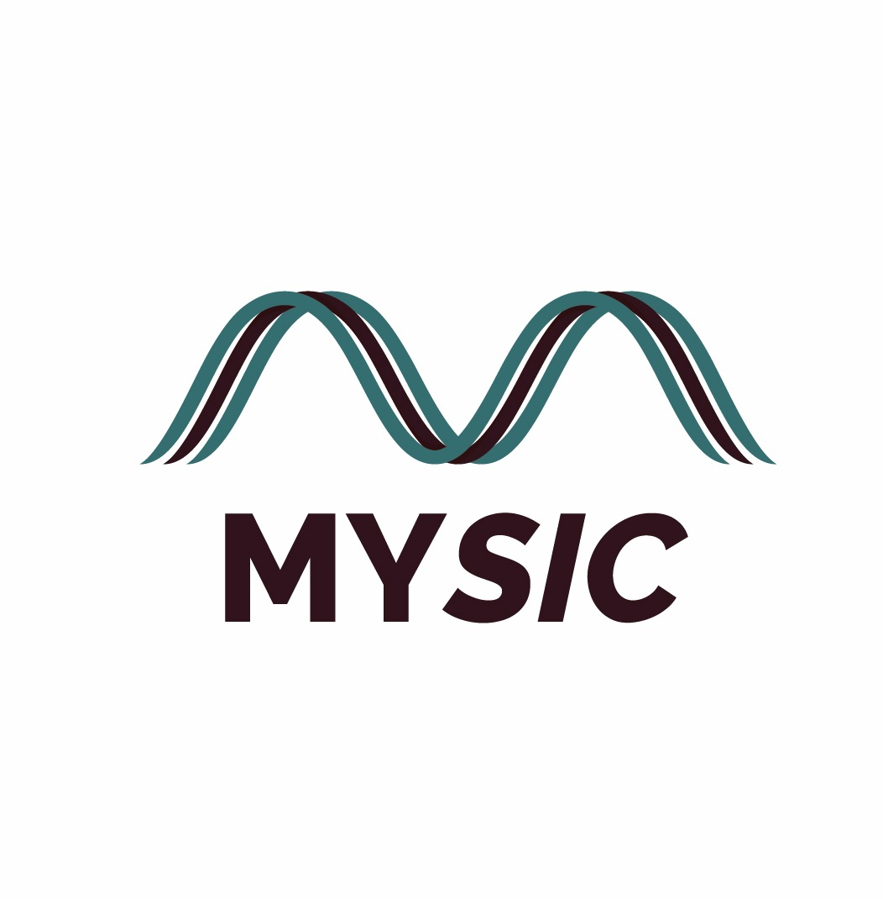
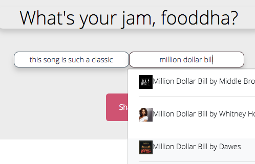
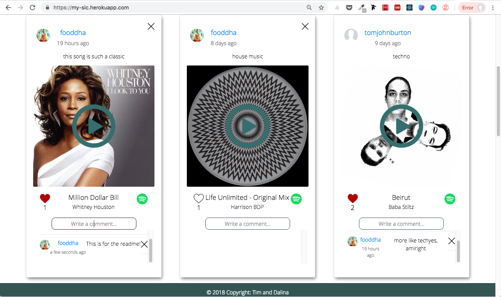
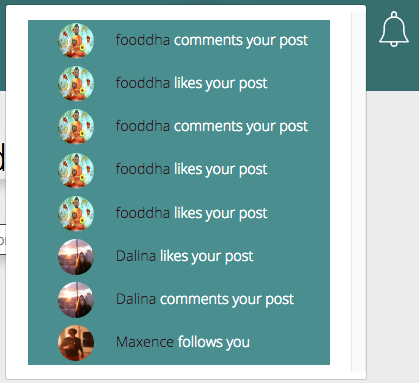
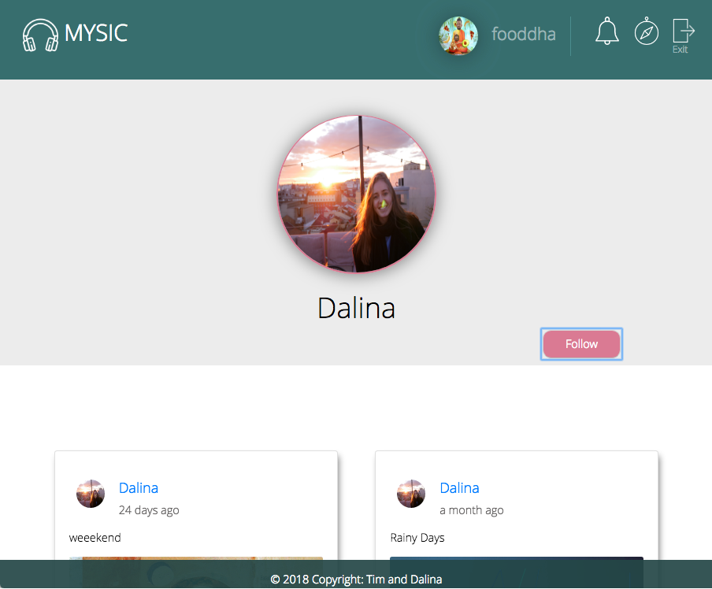

by Tim and Dalina
#### Share your music with your friends!
##### Hear what your friends are listening to.. right now.

## How to run this on your computer
1. Clone or copy this repository
2. `npm install`
3. Run Mongodb from the terminal `sudo mongod`
4. `npm run dev`
5. Go to `http://localhost:3000`

Alternately please direct your browser to the live version on https://my-sic.herokuapp.com

## About

>The social music platform of the future!

This is our final project for Ironhack Berlin's July-October 2018 Full-Stack Web Development bootcamp!

It represents the culmination of our 9 weeks and also specifically our React module. 

The idea is simple: twitter meets spotify. Share the music you are listening to right now, with a simple comment. 
## Follow people who like similar music, follow your friends, make new friends! 

## Here are some screenshots of the app in motion. 
On the Main page you are able to call the spotify api to search for a new song to post along with a comment. 

This will create a new post on your personal feed as well as the main discover feed and anyones feed who follows you. 

You can see in the above photo I liked and commented on the new post. 

This will increase your notifications 

first to 

and then 

Clicking on the button will clear active notifications and display where each notification came from!

You can also click on a users name to view their profile page. Here you can see anything they have posted and follow them to make their posts appear on your main page. 

Of course it is still a work in progress but we are both quite proud of our final product and full of awesome ideas for where it will go next!

### Thanks so much for viewing! Please reach out if you have any questions or ideas! 
